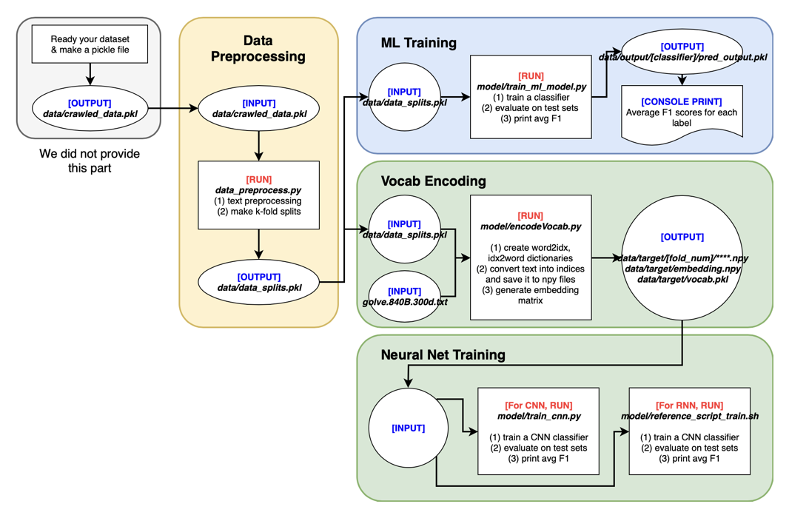

# Comparative Studies of Detecting Abusive Language on Twitter

Python 3.6.0 implementation of ["Comparative Studies of Detecting Abusive Language on Twitter"](http://arxiv.org/abs/1808.10245) accepted in <a href="http://emnlp2018.org/program/workshops/">EMNLP 2018 Workshop on Abusive Language Online (ALW2)</a>.
This paper conducts a comparative study of various learning models on [Hate and Abusive Speech on Twitter](https://github.com/ENCASEH2020/hatespeech-twitter) dataset.
(Last updated: 08-Jul-2019)

## Requirements
The following script will install required Python packages.

```
pip3 install -r requirements.txt
```

## Workflow Diagram


## Ready Your Dataset
We do not provide the code for crawling text data. However, you can ready your dataset by creating **crawled_data.pkl** file in [./data](./data) directory. While creating the pickle file, you will need to create a python dictionary with the following structure: *_dict[_id] = [tweet_label, tweet_text, context_text]*. Then, use *pickle.dump* function to save the dictionary to **crawled_data.pkl** file. (Please refer to the paper to figure out how we defined *context tweet*. If your dataset does not have context, fill '' as the third element of each instance.)

## Data Preprocessing
Data preprocessing consists of two steps:
1. Preprocess raw text data---basic text preprocessing (e.g. handling hashtags and URLs). Please refer to the paper for detailed methods we tried.
2. Randomly split the data into *k* folds for cross-validation.

Run the following script. This will generate **data_splits.pkl** file in [./data](./data) directory. Please double check if you have generated this file successfully before you procede.

```
python3 data_preprocess.py
	--num_splits (Type: int; default: 10)
```

## Traditional Machine Learning Models
In order to report the baselines of feature engineering based machine learning models, we experimented with Naïve Bayes, Logistic Regression, Support Vector Machine, Random Forests, and Gradient Boosted Trees. We tune n-gram ranges and maximum length of features as hyperparameters. Please modify the code [./model/train_ml_models.py](./model/train_ml_models.py) in order to try different settings (e.g. loss function, learning rate, etc.)

Go to the [./model](./model) directory and run the following script with specified parameters.

```
python3 train_ml_models.py
	--feature_level (Feature representation level. 'word' or 'char'; default: 'word')
	--clf (Type of classifier; Type: char)
	--num_splits (Type: int; default: 10)
```

**Parameter Description**
+ clf: We implemented 5 different feature engineering based machine learning classifiers. Use the following representations---'NB': Naïve Bayes, 'LR': Logistic Regression, 'SVM': Support Vector Machine, 'RF': Random Forests, 'GBT': Gradient Boosted Trees
+ ngram_range: Enter a comma-separated string describing the ngram range. For example, '1,3' means that you will use unigram, bigram, and trigram features. In this paper, we used '1,3' for word-level, and '3,8' for character-level representations.
+ max_features: Due to the size of the dataset, you might want to only consider the most significant features (largest feature values). You will use feature values that are normalized with TF-IDF values. We used 14,000 for word-level, and 53,000 for character-level features. Especially for GBT, we reduced feature length even further to 1,200 and 2,300.

Evaluating traiditional machine learning models require pickle files of prediction scores, generated in `./data/output/*MODEL_NAME*/pred_output_*FOLD_NUM*.pkl`. Please double check if you have generated such files successfully from the above training script.
Averaged F1 scores will be printed out on your console.

## Neural Network Models
We experimented Convolutional Neural Networks (CNN) and Recurrent Neural Networks (RNN) as baselines. Before training, we generate vocabulary dictionaries (e.g. word to index), and convert each tweet message into numpy object with its feature representations.

Go to the [./model](./model) directory and run the following script with specified parameters.

```
python3 encodeVocab.py
	--use_glove (Use Glove embedding when True, and random embedding when False; default: True)
	--num_splits (Type: int; default: 10)
```

If you want to use Glove embedding, please download and unzip glove.42B.300d.zip or glove.840B.300d.zip(recommended) file from [here](https://nlp.stanford.edu/projects/glove/). Then put unzipped txt file to the root directory.
**encodeVocab.py** file generates numpy files of text data(converted to indices), embedding numpy file, and word2index and index2word dictionaries into vocab.pkl file. All data will be stored in [./data/target].

### Convolutional Neural Networks
For the CNN models, go to the [./model](./model) directory and run the following script with specified parameters.

```
python3 train_cnn.py
	--feature_level (Feature representation level. 'word', 'char', or 'hybrid'; default: 'word')
	--use_glove (Use Glove embedding when True, and random embedding when False; default: True)
	--num_splits (Type: int; default: 10)
```

**Parameter Description**
+ feature_level = hybrid: HybridCNN is a model that combines word-level and character-level features. Baseline model is proposed by [Park and Fung](https://arxiv.org/abs/1706.01206)

This script will prompt additional input requests in order to specify other hyperparameters such as batch size, filter sizes, learning rate, etc. While training the model, the script will save the best result in [./data/output/*MODEL_NAME*/*FOLD_NUM*/], evaluate the trained model on test sets, and print out the averaged F1 scores on your console.

### Recurrent Neural Networks
For the RNN models, please refer the reference script. (updated 11-Jun-2019)

```
./model/reference_script_train.sh
```

- You can comment out python scripts you don't want to run before running **reference_script_train.sh**. Check hyperparameter values before running the script as well. You can start training RNN models by executing the bash script above.
- results will be displayed in console 
- final results will be appended in "./model/TEST_run_result.txt" 
- [for quick test purpose] preprocessed dataset [<a href="http://milabfile.snu.ac.kr:16000/share-EMNLP-WS-18_abusive/data.tar.gz">link</a>] <br> 
(works only for the RNN models (train_rnn.py, train_rnn_ctx.py) except for character-level RNN (train_rnn_char.py) )

**RNN Variant Models**
+ attn: In order to make the classifier better understand the text sequences, we implemented self-matching attention mechanism ([Wang et al.](http://www.aclweb.org/anthology/P17-1018)) with the RNN baseline models.
+ ltc: Latent Topic Clustering ([Yoon et al.](https://arxiv.org/abs/1710.03430)) extracts latent topic information from the hidden states of RNN in order to classify the data.

## Reference
Please refer the following paper in order to use the code as part of any publications.

```
@article{lee2018comparative,
	title={Comparative Studies of Detecting Abusive Language on Twitter},
	author={Lee, Younghun and Yoon, Seunghyun and Jung, Kyomin},
	journal={arXiv preprint arXiv:1808.10245},
	year={2018}
}
```
